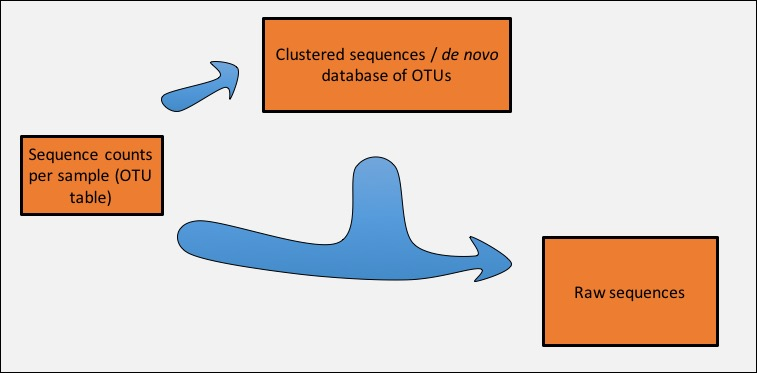

#Data Processing in the Fierer Lab#

**Updated: 12/07/2016**  

**Questions: leff.jonathan@gmail.com**

##Logging in

We will be working with our lab server for this tutorial. Its name is microbe. Your user name is probably your last name plus your first initial (mine is "leffj", for example). To use microbe, open a terminal window, and type and hit return:

	ssh <your microbe user name>@microbe.colorado.edu

##For your first time

###Setting up your password

When you log in for the first time, you will have to set a new password. First, log in using your temporary password. When you set a new password, make sure that it is something secure (i.e. has at least letters and numbers in it). Note, nothing will show up on the screen when you enter passwords.

Important: Please be respectful and do not give your PW out to other people. The server is currently accessible to the whole world, so if your PW falls into the wrong hands, this will make a lot more work for me.


##Processing Data

###Step 0: make a directory to store your files

Let's stay organized:

	mkdir tutorial
	cd tutorial
	pwd

###Step 1: get your mapping file in order

Download the demo mapping file using this link: [http://fiererlab.org/?p=516](http://fiererlab.org/?p=516)

To transfer files to the server, use the command line:

	scp <mapping file path> <microbe user name>@microbe.colorado.edu:<path where you want it to go/>

	If you have a PC, you can simply copy the mapping file from another server location using this command. In the future, you will have to learn another method to transfer files:

	cp /data/shared/2014_02_03_data_tutorial/Demo_16S_MappingFile.txt .

Let's check the mapping file to make sure it is formatted correctly (QIIME command):

	validate_mapping_file.py -h

	validate_mapping_file.py -m Demo_16S_MappingFile.txt -o checkout/

	less checkout/Demo_16S_MappingFile.log

	rm -r checkout
	(**** Be extra careful with the rm command!!!!*****#$%#%#)

###Step 2: prepare the sequence data

**Important** All Fierer lab raw sequence data should be stored in `/data/shared/`

For example, to see the data for this tutorial:

	ls /data/shared/2014_02_03_data_tutorial/

Note the naming convention for directories in `/data/shared`: YYYY\_MM\_DD\_Name

###Step 2a: If your fragments were sequenced through the adapters
**This probably applies to you if your sequences were 200bp or longer and you are not merging paired-end reads.**
**Otherwise, skip to 'Step 2b: Demultiplexing'.**

The issue is that the DNA fragments have synthetic adapters on both ends due to the sequencing process. If the sequences are long enough, they will extend through the adapter on the far (3') end of the fragment. It is important to trim these adapter sequences so that you are analyzing real biological data without artificial sequences.

In order to determine whether this step applies to you, determine the length of your sequences relative to the length of the fragment you intended to sequence. For example, the fragment we generally amplify with the 515f/806rB primer set yields a ~250bp sequenced fragment. If your sequences are >250bp, you will be sequencing through the primer/adapter on the 3' end of the sequence.

You do not need to trim primer/adapter sequences if you plan to merge paired-end reads using USEARCH v8 because that step should trim those sequences by default. However, it never hurts to check to make sure those sequences were actually removed after merging.

To trim primer/adapter sequences, I recommend using a program called 'cutadapt'. For this program to work, it needs to know the adapter sequences you expect to find in each read. Below are the *reverse complemented* primer/adapter sequences associated with the primers we typically use. However, it is always a good idea to check to make sure these are the correct sequences used in your library prep.

	16S rRNA gene forward primer sequence (515f): TTACCGCGGCKGCTGRCAC
	16S rRNA gene reverse primer sequence (806rB): ATTAGAWACCCBNGTAGTCC
	ITS forward primer sequence (ITS1F): TTACTTCCTCTAAATGACCAAG
	ITS reverse primer sequence (ITS2): GCATCGATGAAGAACGCAGC

Use the following command as a base to to trim adapters. This example assumes a mixed 16S/ITS run and removes both sets of adapters simultaneously. Note that we remove reverse adapter/primer sequences from the forward reads and vice versa for the reverse reads. This will not work with the tutorial dataset since the reads are not long enough. It takes approx. 20 min on a MiSeq dataset.

This command is to remove sequences just from forward reads:
	
	cutadapt -a 16S_rev_primer=<16S reverse adapter/primer sequence> -a ITS_rev_primer=<ITS reverse adapter/primer sequence> -O 1 -o <PATH/TO/R1/OUTPUT.fq> Undetermined_S0_L001_R1_001.fastq.gz 1> <PATH/TO/cutadapt.log>

This command is to trim sequences from forward and reverse reads. It is unlikely that you would need to use this command since if both forward and reverse reads exist, you will likely be merging reads and not need to trim primers/adapters beforehand:

	cutadapt -a 16S_rev_primer=<16S reverse adapter/primer sequence> -a ITS_rev_primer=<ITS reverse adapter/primer sequence> -A 16S_fwd_primer=<16S forward adapter/primer sequence> -A ITS_fwd_primer=<ITS forward adapter/primer sequence> -O 1 -o <PATH/TO/R1/OUTPUT.fq> -p <PATH/TO/R2/OUTPUT.fq> Undetermined_S0_L001_R1_001.fastq.gz Undetermined_S0_L001_R2_001.fastq.gz 1> <PATH/TO/cutadapt.log>

You can now use the output files from cutadapt with the normal raw index reads file to do demultiplexing and all other downstream processing steps.

###Step 2b: Demultiplexing

To start processing these data, use this command. This step is called demultiplexing.

	prep_fastq_for_uparse_paired.py -h

	prep_fastq_for_uparse_paired.py -i /data/shared/2014_02_03_data_tutorial/Undetermined_S0_L001_R1_001_t.fastq.gz -r /data/shared/2014_02_03_data_tutorial/Undetermined_S0_L001_R2_001_t.fastq.gz -b /data/shared/2014_02_03_data_tutorial/Undetermined_S0_L001_I1_001_t.fastq.gz -m Demo_16S_MappingFile.txt -o demultiplexed_seqs/ -c

**NOTE:** If you are dealing with sequences that are already demultiplexed by the Illumina software and are distributed in different files (one for each sample), see [here](preparing_already_demultiplexed_data.md).

###Step 2c: Merging paired reads

Merge paired end reads using this command. Note that settings are just guesses and can be altered. **Do not** merge reads unless there is substantial overlap. **Do not** merge blindly or you could bias your data.

	usearch8 -fastq_mergepairs demultiplexed_seqs/demultiplexed_seqs_1.fq -reverse demultiplexed_seqs/demultiplexed_seqs_2.fq -fastq_minovlen 16 -fastq_minmergelen 200 -fastqout demultiplexed_seqs/demultiplexed_seqs_merged.fq -notrunclabels -report demultiplexed_seqs/merge_rpt.txt

	less demultiplexed_seqs/merge_rpt.txt

###Step 3: Prepare sequences for de novo database creation





####Check quality of sequences (optional)

	usearch8 -fastq_stats demultiplexed_seqs/demultiplexed_seqs_merged.fq -log demultiplexed_seqs/demultiplexed_seqs_merged.log

	less demultiplexed_seqs/demultiplexed_seqs_merged.log

####Conduct quality filtering

	usearch8 -fastq_filter demultiplexed_seqs/demultiplexed_seqs_merged.fq -fastaout seqs_filt.fa -fastq_maxee_rate 0.005

####Dereplicate sequences

	usearch8 -derep_fulllength seqs_filt.fa -fastaout seqs_filt_derep.fa -sizeout

####Remove singleton sequences

	usearch8 -sortbysize seqs_filt_derep.fa -fastaout seqs_filt_derep2.fa -minsize 2

###Step 4: Cluster filtered sequences to create de novo database

This is done at the 97% similarity level by default

	usearch8 -cluster_otus seqs_filt_derep2.fa -otus rep_set.fa -relabel 'OTU_'

At this stage the de novo database can be optionally filtered against an existing public database to remove highly divergent sequences. For example:

	usearch8 -usearch_global rep_set.fa -db /db_files/gg_files/gg_13_8_otus/rep_set/97_otus.fasta -id 0.75 -strand both -matched rep_set_filt.fa

Note that if you do **not** do this, you will have to change the input when mapping raw reads back to the rep set in step 5.

###Step 5: Map the raw/demultiplexed (fasta formatted) sequences to the de novo database and build the OTU table

	usearch8 -usearch_global demultiplexed_seqs/demultiplexed_seqs_merged.fq -db rep_set_filt.fa -id 0.97 -strand plus -uc readmap.uc -notrunclabels

	create_otu_table_from_uc_file.py -i readmap.uc -o otu_table.txt

###Step 6: Add taxonomic classifications

The goal of this step is to provide taxonomic classifications for each OTU. We do this using the RDP classifier with the GreenGenes database.

	biom convert -i otu_table.txt -o otu_table.biom --table-type 'OTU table' --to-json

	assign_taxonomy.py -m rdp -i rep_set.fa -o rdp_assigned_taxonomy -c 0.5 -t /db_files/gg_files/gg_13_8_otus/taxonomy/97_otu_taxonomy.txt -r /db_files/gg_files/gg_13_8_otus/rep_set/97_otus.fasta --rdp_max_memory 10000

	biom add-metadata -i otu_table.biom --observation-metadata-fp rdp_assigned_taxonomy/rep_set_tax_assignments.txt --sc-separated taxonomy --observation-header OTUID,taxonomy -o otu_table_wTax.biom

###Step 7: Remove chloroplasts/mitochondria and summarize the OTU table

It is a good idea to check for and remove chloroplast and mitochondria sequences in most sample types:

	filter_taxa_from_otu_table.py -i otu_table_wTax.biom -o otu_table_wTax_noChloroMito.biom -n c__Chloroplast,f__mitochondria

Check the number of sequences per sample:

	biom summarize-table -i otu_table_wTax_noChloroMito.biom -o otu_table_wTax_noChloroMito_smry.txt

###Step 8: Odds and ends

Convert rarefied OTU table back to text format if desired:

	biom convert -i otu_table_wTax_noChloroMito.biom -o otu_table_wTax_noChloroMito.txt --to-tsv --header-key=taxonomy

Move files to local directory (in terminal on local computer):

	scp <user name>@microbe.colorado.edu:/data/<user name>/tutorial/ otu_table_wTax_noChloroMito.biom .

	scp -r <user name>@microbe.colorado.edu:/data/<user name>/tutorial/sumtax .


##Extra Credit \-\- Avoid entering microbe PW every time

You can configure ssh, so that as long as you have one terminal window connected to microbe, you won't have to enter your password when you connect via other windows. For instance, if you are browsing files on microbe using ssh and then want to transfer them to your laptop, keep the ssh window open and use scp from your laptop in another terminal window, and you won't need to enter your password. This saves some time and annoyance.

To do the configuration:

	mkdir ~/.ssh/sockets
	vi ~/.ssh/config

use the text editor (`i` for insert mode, remember) to add the following text:

	Host microbe
		HostName microbe.colorado.edu
		ControlMaster auto
		ControlPath ~/.ssh/sockets/%r@%h:%p
	User <microbe user name>

Press `esc`, then `:wq`

Now, whenever you would've used `microbe.colorado.edu`, you can just type, `microbe`